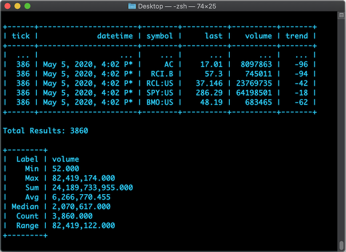

# PHPTable
PHPTable  - for your Terminal scripts

## Why use it?
- Compact code size (only 130 lines)
- Auto space & truncating
- Built-in stats calculations
- Built-in data normalizer (MinMaxScale 0-1)

## Screenshots


## Usage
```php
require_once 'table.class.php';

$table = new Table();

// add labels to your table ..
$table->setLabels([
	'tick',
	'action',
	'time',
	'price',
	'change',
	'from open',
	'volume',
	'trend'
]);

// add data ..
$table->addData([
	1,
	'action',
	'Apr 23, 2020, 9:30 AM',
	67.72,
	0,
	0.39,
	'31,332'
]);

// print the table ..
$table->Print();

// or tail last 5 results ..
$table->Print(5);

// print stats for a Label, returns an Array ..
$table->Stats('volume');

// normalize data (MinMaxScale) ..
$table->MinMaxScale('volume');

// call Stats() without params to show labels, returns False ..
$table->Stats();

// export to CSV ..
$table->export('filename.csv');
```

## License
MIT
